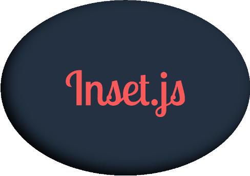

# Inset.js

<p align="center" >
  
</p>

[](http://standardjs.com/)
[](https://www.npmjs.com/package/inset.js)

Inset shadows for HTML's `<canvas>` element.

Trying to draw inset shadows using the HTML Canvas API can be suprisingly difficult, often requiring obscure techniques like [duplicating your drawing code](http://stackoverflow.com/a/27892121), [using the `clip` method](https://www.rgraph.net/blog/an-example-of-html5-canvas-shadows.html#inner-shadows), or ["opposite winding"](https://www.html5rocks.com/en/tutorials/canvas/texteffects/#toc-inner-shadow).

In contrast, Inset.js requires only a single line of code, and does not require you to duplicate any code. See the [Inset!](#inset) section for more details. This is achieved by a combination of an off-screen canvas for some fancy alpha inversion (inspired by [this StackOverflow post](http://stackoverflow.com/a/37380488)), along with monkey-patching a few select  methods on CanvasRenderingContext2D.

Inset.js currently supports inset shadows on shapes drawn with `fillRect`, shapes drawn with `drawImage`, or shapes drawn using the path functions (`beginPath`, `moveTo`, `lineTo`, `arc`, `arcTo`, etc.) and then `fill`.

## Usage

### Install

Inset.js was developed with a modern JavaScript workflow in mind. To use it, it's recommended you have a build system in place that can transpile ES6 and bundle modules. For a minimal boilerplate that does so, check out [outset](https://github.com/callmecavs/outset).

Using NPM, install Inset.js, and add it to your package.json dependencies.

```bash
npm install inset.js --save
```

Then import Inset.js in your main JavaScript file. Do not bind any variables, as Inset.js does all its work in the background and does not export anything.

```javascript
import 'inset.js'
```

### Include

If you are not using a build system capable of transpiling ES6 and bundling modules, you can just inlcude Inset.js directly:

```html
<!-- Include Inset.js -->
<script src="/dist/inset.browser.js"></script>
```

### Inset!

Simply set 

```javascript
ctx.shadowInset = true;
```

and then draw a shape as you normally would. For example:

```javascript
var c = document.getElementById('canvas');
var ctx = c.getContext('2d');

ctx.shadowInset = true;
ctx.shadowBlur = 15;
ctx.shadowColor = 'black';

ctx.fillStyle = 'red';
ctx.fillRect(50, 50, 50, 50);
```

## Example

http://codepen.io/patlillis/pen/vxaery

## Development

### Testing

Tests are performed using [Mocha](https://mochajs.org/), along with a little help from the excellent [imagediff](https://github.com/HumbleSoftware/js-imagediff) library. Since this project relies on the browser-based Canvas API, tests are run in a browser-like environment. Currently, the only way to perform tests is in an actual full real browser.

To run tests locally, first clone this repo and install all the necessary NPM packages. Then run the tests using the provided NPM script.

```bash
git clone https://github.com/patlillis/inset.js
cd inset.js
npm install
npm test
```

Test results will be displayed in a lovely interactive UI using Mocha's [HTML](https://mochajs.org/#html) reporter. As a bonus, it will also display image diffs of all canvas tests.

### NPM Tasks

Several NPM tasks are provided for ease of development. If you're really curious, check out [package.json](package.json) for more details.

| Task                | Usage                                                                                 |
| ------------------- | ------------------------------------------------------------------------------------- |
| `npm run build`     | Build Inset.js from [src/](src) to [dist/](dist). Includes module and browser builds. |
| `npm run dev`       | Build development version of Inset.js.                                                |
| `npm run dev:watch` | Build development version of Inset.js, and rebuild when any files change.             |
| `npm run lint`      | Check code for style errors. Checks all *.js files in [src/](src) and [test/](test).  |
| `npm run test`      | Start up a browser to run tests on Inset.js. Loads the [test page](test/manual.html). |

<!--
### Command line

Command line tests are performed using [PhantomJS](http://phantomjs.org/) (hooked into Mocha with [phantom-js-core](https://github.com/nathanboktae/mocha-phantomjs-core)). Once you have run `npm install`, it should be as simple as

```bash
npm run test
```

Test results will be displayed in the terminal.
-->

## License

[Code licensed MIT](LICENSE). © 2017 Pat Lillis.

[](http://forthebadge.com)
